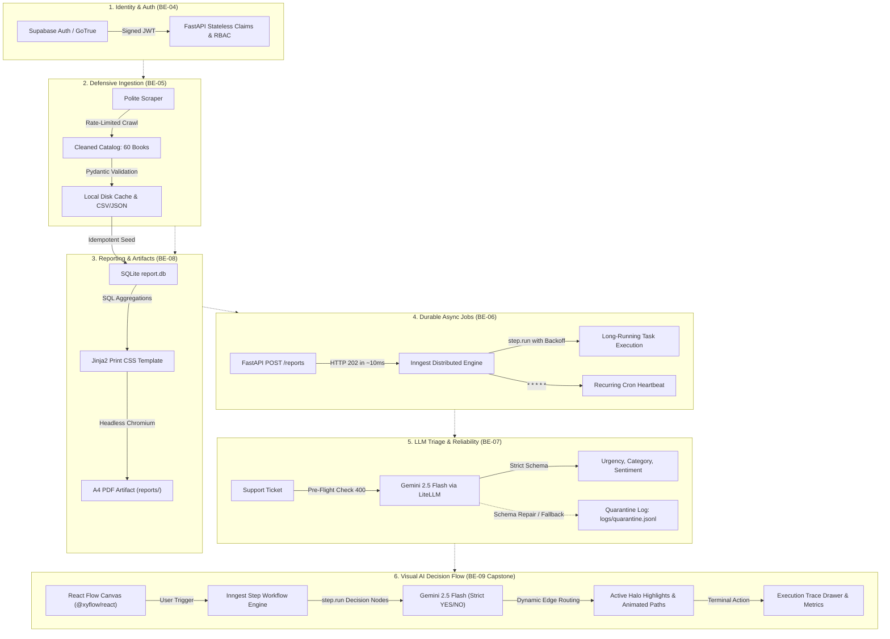

# FlyRank Applied Backend AI Engineering Practicum

[](https://www.python.org/)
[](https://fastapi.tiangolo.com/)
[](https://reactflow.dev/)
[](https://www.inngest.com/)
[](https://supabase.com/)
[](https://playwright.dev/)
[](LICENSE)

A production-grade engineering repository documenting the implementation of the **FlyRank Applied Backend AI Engineering Practicum**. This codebase spans core distributed backend patterns, asynchronous job queues, defensive data collection, reliable LLM guardrails, print artifact generation, and autonomous visual AI decision graph orchestration.

---

## 🏛️ System Architecture

The practicum models a complete SaaS backend ecosystem, moving from decentralized identity and defensive data ingestion to durable event-driven pipelines and autonomous AI graph execution:



---

## 📅 Applied Deliverables Matrix

### Core Backend AI Engineering Track (Weeks 4–7)

All 6 required assignments have been implemented in modular subdirectories, verified with automated test suites, and submitted on the FlyRank Internship portal.

| Module | Code | Title | Key Architectural Focus | Status |
|---|---|---|---|---|
| [`assignment_4/`](./assignment_4) | **BE-04** | Fast-API + Supabase Auth & JWT Claims | Stateless HS256 JWT signature verification, PyJWT claim validation, and RBAC (`user` vs `admin`). | **Submitted** |
| [`assignment_5/`](./assignment_5) | **BE-05** | The Polite Web Scraper | Rate-limited crawling (1.0s delay), Pydantic schema validation, local disk cache, and 404 survival. | **Submitted** |
| [`assignment_6/`](./assignment_6) | **BE-06** | Background Job Service with Inngest | "Accept fast, work in background" (HTTP 202 in ~10ms), multi-step workflows with retries, and cron heartbeats. | **Submitted** |
| [`assignment_7/`](./assignment_7) | **BE-07** | Customer Support Ticket Triage Service | Gemini 2.5 Flash via LiteLLM, versioned prompt contracts, pre-flight checks, self-healing schemas, cost logging, and 100% evals. | **Submitted** |
| [`assignment_8/`](./assignment_8) | **BE-08** | PDF Report Generator & Artifact Handling | SQLite SQL aggregations, Playwright HTML-to-PDF rendering with print CSS page-break prevention, "Store and Link" API, and daily idempotency. | **Submitted** |
| [`assignment_9/`](./assignment_9) | **BE-09** | AI Decision Flow (React Flow + Inngest Capstone) | Interactive DAG canvas (`@xyflow/react`), durable Inngest step routing, strict binary YES/NO LLM branching, animated glowing paths, and SQLite persistence. | **Submitted** |

---

### Foundational Backend Modules (Weeks 1–3)

| Module | Scope | Highlights |
|---|---|---|
| [`assignment_1/`](./assignment_1) | HTTP API Foundations | In-memory Task CRUD service using FastAPI and Pydantic validation. |
| [`assignment_2/`](./assignment_2) | SQLite Persistence | Migrated in-memory state to persistent SQLite storage while keeping API contracts intact. |
| [`assignment_3/`](./assignment_3) | Containerization & PostgreSQL | Containerized stack via Docker Compose, pairing FastAPI with PostgreSQL using the Repository Pattern. |

---

### Applied Strategy & Systems Track (Weeks 1–4)

| Directory | Theme | Core Concepts |
|---|---|---|
| [`assignment_w1_sitemap/`](./assignment_w1_sitemap) | Sitemap & Model Toolkit | Architecture sitemap design, CTA routing, and model benchmarking across Claude, OpenAI, and Gemini. |
| [`assignment_w2_cases/`](./assignment_w2_cases) | Backend Architecture Cases | Comparative persistence analysis and production trade-offs. |
| [`assignment_w2_ladder/`](./assignment_w2_ladder) | Evaluation Ladders | Metric-driven evaluation ladders and rubric-based output scoring. |
| [`assignment_w3_curate/`](./assignment_w3_curate) | Context Curation | Token window curation, noise reduction, and dataset cleaning. |
| [`assignment_w3_identity/`](./assignment_w3_identity) | System Prompts & Personas | Persona modeling, system instructions, and defensive guardrails. |
| [`assignment_w3_throughline/`](./assignment_w3_throughline) | Architectural Narratives | Engineering narratives, design rationale, and technical framing. |
| [`assignment_w4_blankpage/`](./assignment_w4_blankpage) | Problem Formulation | Deconstructing ambiguous business problems into discrete backend components. |
| [`assignment_w4_threeroads/`](./assignment_w4_threeroads) | AI Strategy Trade-Offs | Evaluated trade-offs between Fine-Tuning, RAG, and Agentic Tool Use. |

---

## 🔍 Deep-Dive: Core Backend Modules

### 1. Identity & Role-Based Access Control (`assignment_4/`)
* **Problem**: Decouple user authentication from API business logic without incurring network overhead on every incoming HTTP request.
* **Solution**: Integrated with a cloud Supabase project (`flyrank-auth-service`). Authenticates via GoTrue and signs HS256 JWTs containing `app_metadata.role`. The FastAPI backend cryptographically validates the token signature locally using `PyJWT` in <1ms.
* **Endpoints**: `POST /auth/signup`, `POST /auth/login`, `GET /users/me`, `GET /admin/dashboard`.
* **Tests**: Automated pytest suite verifying token tampering rejection (401) and non-admin privilege denial (403).

### 2. Polite Web Scraper (`assignment_5/`)
* **Problem**: Collect web data defensively without overloading target servers or failing on inconsistent HTML markup.
* **Solution**: Scraped 60 books across 3 pages of `books.toscrape.com`. Built with a strict 1.0s delay per request, custom `User-Agent`, disk-backed request cache, and Pydantic field validators converting text ratings (`"Three"`) to integers (`3`).
* **Artifacts Generated**: `output/books.json`, `output/books.csv`, `output/run-report.json`.
* **Tests**: 6 passing pytest tests verifying schema compliance, rate-limiting, and 404 survival.

### 3. Background Job Service with Inngest (`assignment_6/`)
* **Problem**: Heavy workloads block synchronous HTTP threads, degrading user experience and causing gateway timeouts (504s).
* **Solution**: Implemented the "Accept fast, work in background, report status" pattern using the Inngest Python SDK. `POST /reports` dispatches an asynchronous event via `asyncio.create_task` and returns `202 Accepted` in ~10ms.
* **Inngest Functions**:
  - `say-hello`: Fast 5-second simulated background task.
  - `make-report`: Heavy 8-second multi-step task with retries, exponential backoff, and deliberate failure on topic `"fail"`.
  - `heartbeat`: 1-minute recurring cron task (`* * * * *`).
* **Tests**: 8 passing pytest tests validating response times and state transitions.

### 4. Support Ticket Triage Service (`assignment_7/`)
* **Problem**: Production LLM integrations must guard against hallucinated schemas, runaway token costs, and high latency.
* **Solution**: Built an automated ticket classifier using **Gemini 2.5 Flash** via LiteLLM. Enforces versioned prompt contracts (`prompts/triage-v1.md`) with pre-flight input validation (400 on empty strings), an automatic repair loop, quarantine logging (`logs/quarantine.jsonl`), and a kill switch (`LLM_ENABLED=false`).
* **Cost & Performance**: ~$0.0001 per ticket ($1.06 per 10k tickets) at ~1.2s latency.
* **Evaluation**: **8/8 (100%)** accuracy on ground-truth benchmark suite.

### 5. PDF Report Generator (`assignment_8/`)
* **Problem**: Producing multi-page PDF documents from database aggregations without slicing table rows across page boundaries.
* **Solution**: Reused the 60-book dataset from Assignment 5 inside SQLite (`report.db`). Formatted SQL aggregations (`COUNT`, `AVG`, `GROUP BY rating`) into a Jinja2 template and printed to A4 PDF using **Playwright Headless Chromium**.
* **Print CSS Fix**:
  ```css
  @page { size: A4; margin: 18mm 14mm; }
  thead { display: table-header-group; }
  tr { break-inside: avoid; page-break-inside: avoid; }
  ```
* **Store and Link Architecture**: `POST /reports` returns a 201 link; `GET /reports/{id}/file` streams bytes directly from disk. Duplicate same-day requests return cached files (200 OK) with `{ "force": true }` cache bypass.

### 6. AI Decision Flow (React Flow + Inngest Capstone) (`assignment_9/`)
* **Problem**: Build a visual, full-stack workflow engine where each node represents an autonomous AI decision step returning strictly `YES` or `NO`.
* **Solution**:
  - **Frontend**: React 18 + Vite + `@xyflow/react` + Tailwind CSS. Custom `AIDecisionNode` with editable prompts, status rings, reasoning snippets, and dual `YES`/`NO` handles. Custom `DecisionEdge` with animated glowing dash strokes.
  - **Backend**: FastAPI + Inngest Python SDK. Each graph node executes as a durable Inngest step (`ctx.step.run(...)`).
  - **Decision Engine**: Gemini 2.5 Flash evaluates the prompt against ticket context, strictly returning `YES` or `NO` with justification, dynamically traversing the matching edge.
  - **Single-Port Distribution**: Pre-built static assets are served directly from FastAPI on `http://localhost:8000`.

---

## 🛠️ Global Technology Stack

| Category | Technologies |
|---|---|
| **Core Languages** | Python 3.10+, JavaScript / TypeScript (Node.js 22+) |
| **Backend Frameworks** | FastAPI, Starlette, Pydantic v2, Uvicorn |
| **Frontend Frameworks** | React 18, Vite, `@xyflow/react` (React Flow), Tailwind CSS, Lucide Icons |
| **Workflow & Orchestration** | Inngest (Python SDK), Inngest Dev Server |
| **Databases & Storage** | SQLite, PostgreSQL, Supabase Cloud Auth |
| **AI & LLM Services** | Google Gemini 2.5 Flash, LiteLLM, Google GenAI SDK |
| **Rendering & Automation** | Playwright (Headless Chromium), WeasyPrint, BeautifulSoup4 |
| **Testing & Tooling** | Pytest, Pytest-Asyncio, HTTPX, uv, Docker Compose |

---

## 🚀 Quickstart & Setup

### Prerequisites
- Python 3.10+ (managed via `uv` or `venv`)
- Node.js 20+ & npm
- Git

### 1. Clone Repository & Setup Environment
```bash
git clone https://github.com/msaad53407/flyrank_ai_backend_ai_engineering_internship.git
cd flyrank_ai_backend_ai_engineering_internship
```

### 2. Running the Capstone: AI Decision Flow (`assignment_9`)
The capstone can be executed from a single command:
```bash
cd assignment_9/backend

# Create virtual environment and install dependencies
uv venv .venv
source .venv/bin/activate
uv pip install fastapi "uvicorn[standard]" inngest litellm pydantic python-dotenv httpx pytest pytest-asyncio

# Configure environment variables
cp .env.example .env
# Edit .env and set GEMINI_API_KEY

# Build frontend static distribution (already pre-built in static/)
cd ../frontend && npm install && npm run build && cd ../backend

# Launch the full-stack server
python -m uvicorn src.main:app --host 127.0.0.1 --port 8000
```
Open **`http://localhost:8000`** in your browser to interact with the visual canvas.

### 3. Running Automated Tests Across Modules
Each assignment contains a dedicated automated test suite:
```bash
# Assignment 4 (Auth & JWT)
cd assignment_4 && pytest tests/

# Assignment 5 (Scraper)
cd assignment_5 && pytest tests/

# Assignment 6 (Inngest Background Jobs)
cd assignment_6 && pytest tests/

# Assignment 7 (LLM Ticket Triage & Evals)
cd assignment_7 && pytest tests/ && python evals/run_evals.py

# Assignment 8 (PDF Generator & Idempotency)
cd assignment_8 && pytest tests/

# Assignment 9 (AI Decision Flow Capstone)
cd assignment_9/backend && pytest tests/
```

---

## 📜 License
This repository is licensed under the [MIT License](LICENSE).
