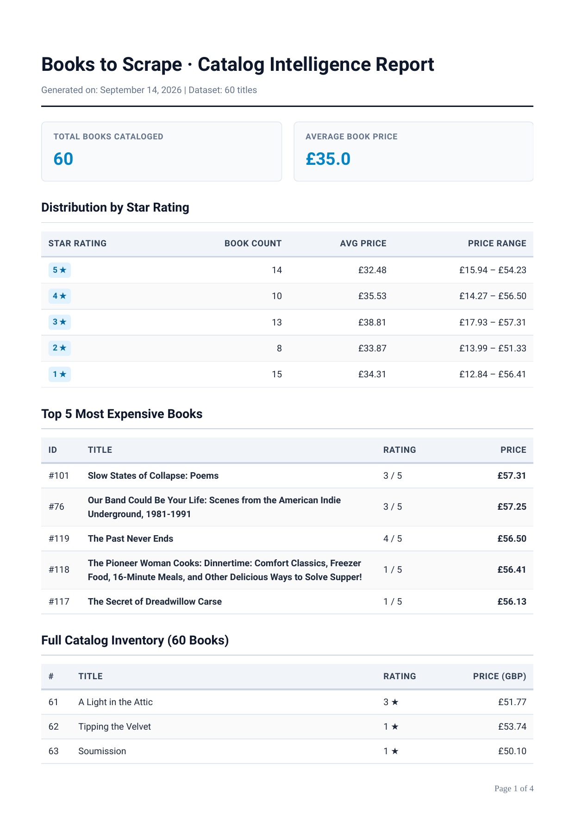

# Assignment 8: PDF Report Generator

A clean, production-grade PDF reporting pipeline built with **FastAPI**, **SQLite**, and **Playwright (Headless Chromium)**.

Query your data with SQL aggregations, render it into a multi-page PDF with clean print CSS page breaks, store the generated artifact on disk, and serve it by link — with built-in daily idempotency caching.



---

## Architecture & Big Idea: "Store and Link"

A report feature follows a four-move pipeline:
1. **Query**: Aggregation queries turn catalog rows into high-level business numbers (`COUNT`, `AVG`, `GROUP BY`).
2. **Render**: A styled Jinja2 HTML template combined with aggregated data is rendered into an A4 PDF document via headless Chromium.
3. **Store**: The artifact (`.pdf`) is saved on disk (`reports/`); its path and metadata are saved in SQLite (`report.db`).
4. **Serve**: The client receives a lightweight JSON response with a download URL (`/reports/{id}/file`). Megabytes stream directly from disk on demand; API payloads remain fast and lightweight.

---

## Dataset Selection: Option B (Bookstore Catalog)

This assignment utilizes **Option B**: the real dataset of 60 validated book records collected in **Assignment 5 (The Polite Scraper)** from `books.toscrape.com`.

The seed script loads `assignment_5/output/books.json` into SQLite (`report.db`) under the `books` table (`id`, `title`, `price`, `rating`, `url`).

### Idempotent Seeding
The seed script wipes existing rows before inserting records, ensuring running it repeatedly always produces exactly 60 records:
```bash
python src/seed.py
```
Verification:
```sql
SELECT COUNT(*) FROM books; -- Returns 60
```

---

## Aggregation SQL Queries

Located in `src/queries.py`, these queries turn 60 individual records into executive summary metrics:

### 1. Catalog Totals & Average Price
```sql
SELECT COUNT(*) as total_books FROM books;
SELECT AVG(price) as avg_price FROM books;
```

### 2. Top 5 Most Expensive Books
```sql
SELECT id, title, price, rating, url 
FROM books 
ORDER BY price DESC 
LIMIT 5;
```

### 3. Distribution Breakdown by Star Rating
```sql
SELECT 
    rating, 
    COUNT(*) as book_count, 
    ROUND(AVG(price), 2) as avg_price,
    ROUND(MIN(price), 2) as min_price,
    ROUND(MAX(price), 2) as max_price
FROM books 
GROUP BY rating 
ORDER BY rating DESC;
```

---

## Handling the Page-Break Trap

When rendering multi-page tables (such as the 60-row catalog appendix), browser print engines often slice table rows in half across page boundaries. 

We solve this cleanly in `src/templates/report.html` using modern Print CSS:
```css
@page {
    size: A4;
    margin: 18mm 14mm 18mm 14mm;
}

/* Repeat table header on every printed page */
thead {
    display: table-header-group;
}

/* Prevent rows from splitting across page breaks */
tr {
    break-inside: avoid;
    page-break-inside: avoid;
}

.kpi-card, .chart-card, .table-card {
    break-inside: avoid;
    page-break-inside: avoid;
}
```

The resulting document renders across 4 crisp A4 pages with repeating headers and zero sliced rows.

---

## Quickstart & Run Instructions

### 1. Environment & Dependencies
```bash
cd assignment_8
python -m venv .venv
source .venv/bin/activate
pip install -r pyproject.toml
playwright install chromium
```

### 2. Seed Database
```bash
python src/seed.py
```

### 3. Launch API Server
```bash
uvicorn src.main:app --port 8000 --reload
```

### 4. Run Automated Test Suite
```bash
pytest tests/
```

---

## API Proof: POST & Download Verification

### 1. Generate Report (`POST /reports`)
```bash
curl -i -X POST http://localhost:8000/reports
```
**Response:**
```http
HTTP/1.1 201 Created
content-type: application/json

{"id": "6f12c390", "file": "/reports/6f12c390/file"}
```

### 2. Retrieve Metadata (`GET /reports/{id}`)
```bash
curl -i http://localhost:8000/reports/6f12c390
```
**Response:**
```http
HTTP/1.1 200 OK
content-type: application/json

{"id": "6f12c390", "file": "/reports/6f12c390/file", "created_at": "2026-09-14T20:30:15.123456"}
```

### 3. Download PDF File by Link (`GET /reports/{id}/file`)
```bash
curl -i -o my-report.pdf http://localhost:8000/reports/6f12c390/file
```
**Response:**
```http
HTTP/1.1 200 OK
content-type: application/pdf
content-disposition: attachment; filename="report-2026-09-14-6f12c390.pdf"
content-length: 48922
```

### 4. Unknown Report (`GET /reports/unknown-id`)
```bash
curl -i http://localhost:8000/reports/nonexistent
```
**Response:**
```http
HTTP/1.1 404 Not Found
content-type: application/json

{"detail": "Report with id 'nonexistent' not found."}
```

---

## Stage 4 & Stage 5 Reflections

### Stage 4: "Feel the Wait" — When to Move Work Out of the Request
> **Question:** At what point would you move this work out of the HTTP request into a background job?  
> **Answer:** I would move this work out of the HTTP request into a background job queue (such as Inngest or Celery) as soon as rendering takes longer than ~500ms–1s (e.g., datasets scaling beyond a few hundred rows or concurrent traffic causing CPU spikes), because holding synchronous HTTP connections open leaves clients vulnerable to gateway timeouts (504s), exhausts web worker threads, and degrades the user experience.

### Stage 5: "Ask Twice, Get One" — Idempotency
> **Question:** What does your idempotency check protect against, and what is a real-world example where a missing check costs money?  
> **Answer:** The once-per-day idempotency check protects against duplicate report generation triggered by impatient double-clicks, automated retry loops, or multiple dashboard tabs requesting the same daily snapshot, preventing wasted Chromium rendering CPU cycles, disk bloat, and database clutter.  
> In the real world, an automated invoice or billing summary dispatch system lacking idempotency would generate duplicate billing records upon a retry or double-click; downstream webhook workers or notification services would charge customer payment methods twice or dispatch duplicate invoice emails, triggering costly chargebacks, merchant dispute fees, and severe loss of customer trust.

### Idempotency Proof
```bash
# First request generates report (201 Created):
curl -i -X POST http://localhost:8000/reports
# HTTP/1.1 201 Created
# {"id": "6f12c390", "file": "/reports/6f12c390/file"}

# Immediate second request returns existing cached report (200 OK):
curl -i -X POST http://localhost:8000/reports
# HTTP/1.1 200 OK
# {"id": "6f12c390", "file": "/reports/6f12c390/file", "cached": true}

# Request with force=true bypasses cache and creates a fresh report (201 Created):
curl -i -X POST http://localhost:8000/reports -H "Content-Type: application/json" -d '{"force": true}'
# HTTP/1.1 201 Created
# {"id": "d93ad9dd", "file": "/reports/d93ad9dd/file"}
```

---

## Extras Implemented

1. **Reports Control Panel (`GET /reports`)**: Lists all generated reports chronologically with links.
2. **Standardized Dated Filenames**: Reports are saved using `report-YYYY-MM-DD-<id>.pdf` format.
3. **Comprehensive Pytest Suite (`tests/test_report.py`)**: 5/5 unit tests covering health, database seeding & aggregations, generation pipeline, file streaming, and idempotency guarantees.
