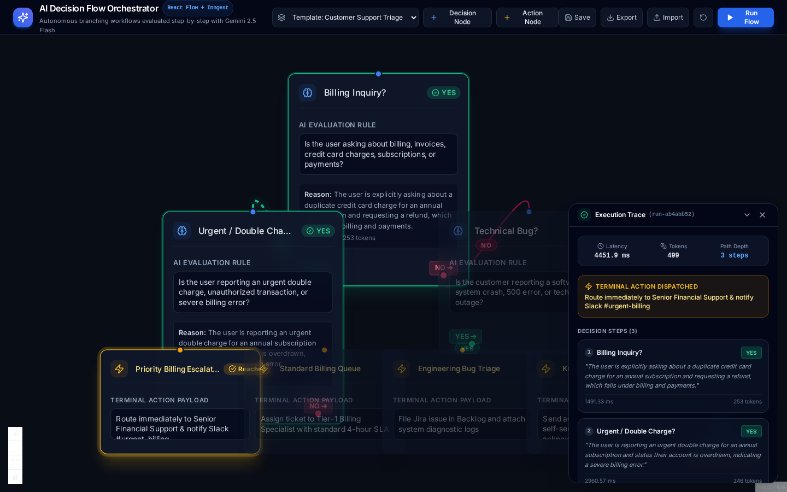
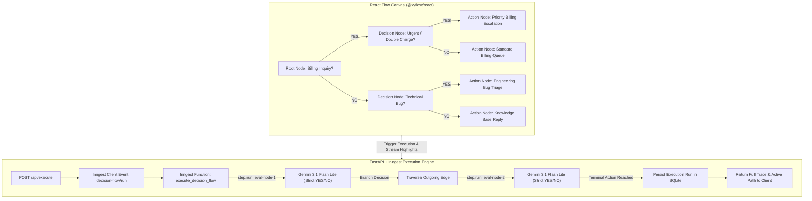

# Assignment 9 (BE-09 Capstone): AI Decision Flow with React Flow + Inngest

A full-stack, visual AI workflow orchestration platform where each node represents an autonomous AI decision step returning strictly **`YES`** or **`NO`**. Workflow execution is orchestrated step-by-step through **Inngest** on the backend and visualized dynamically with **React Flow** on the frontend.



---

## System Architecture & Data Flow



---

## Core Features & Phase Deliverables

### Phase 1: Setup & Foundations
- **FastAPI Backend**: Clean modular architecture with REST API endpoints, SQLite persistence, and Inngest dev server support (`is_production=False`).
- **React Flow Frontend**: React 18, Vite, `@xyflow/react`, and Tailwind CSS dark theme.
- **Single-Port Unified Distribution**: Built frontend static assets are served directly from FastAPI at `http://localhost:8000`, with standalone Vite dev server support on port 5173.

### Phase 2: Custom Graph Nodes & Edges
- **`AIDecisionNode`**: Displays decision title, prompt textarea, live execution status badges (`Thinking...`, `YES`, `NO`), evaluation reasoning with token/latency metrics, and dual handles (`YES` in emerald, `NO` in rose).
- **`ActionNode`**: Terminal node displaying triggered workflow actions (e.g. "Priority Billing Escalation", "Engineering Bug Triage").
- **`DecisionEdge`**: Bezier curves with interactive pill badges (`YES` / `NO`). Traversed edges light up with glowing animated dashes.

### Phase 3: Inngest Step Orchestration & Strict AI Decisions
- **Inngest Workflow Function (`decision-flow/run`)**: Each decision node maps to an Inngest step (`ctx.step.run(...)`) ensuring durable, observable step-by-step execution.
- **Strict YES / NO Enforcement**: Prompts are evaluated using **Gemini 3.1 Flash Lite** with JSON schema enforcement and regex validation, returning strictly `YES` or `NO` with one-sentence reasoning.
- **Dynamic Branch Traversal**: Edge traversal dynamically inspects the model's decision and routes to the matching edge (`sourceHandle="yes"` or `"no"`).

### Phase 4: Polish & Developer Experience (All 7 Features Built)
1. **Visual Execution State**: Real-time highlighting of running node (pulsing border), completed node (emerald or rose halos), and skipped nodes (dimmed).
2. **Animated Active Edges**: Active path glows and animates along the chosen YES or NO edges.
3. **Execution Trace Panel**: Slide-over drawer detailing overall latency, token usage, path length, final action dispatched, and step-by-step decision reasoning.
4. **Pre-Built Templates**:
   - *Customer Support Triage* (Billing -> Urgent -> Tech Bug -> FAQ)
   - *Enterprise Sales Lead Qualifier* (Enterprise Scale -> Immediate Timeline -> VIP AE Demo)
5. **Workflow Persistence**: SQLite CRUD operations (`/api/workflows`), Save Flow, and Load Flow.
6. **JSON Export / Import**: Instant download and upload of `.json` workflow graph configurations.
7. **Automated Pytest Suite**: 6/6 unit tests covering graph traversal, engine branch resolution, API routes, and static asset delivery.

---

## Quickstart & Run Instructions

### 1. Backend Setup
```bash
cd assignment_9/backend
# Create virtual environment and install dependencies
uv venv .venv
source .venv/bin/activate
uv pip install fastapi "uvicorn[standard]" inngest litellm pydantic python-dotenv httpx pytest pytest-asyncio

# Configure environment
cp .env.example .env
# Set your GEMINI_API_KEY in .env
```

### 2. Frontend Build
```bash
cd ../frontend
npm install
npm run build
```
*(Build output is compiled directly into `backend/static/`)*

### 3. Launch Server
```bash
cd ../backend
python -m uvicorn src.main:app --host 127.0.0.1 --port 8000
```
Open your browser at **`http://localhost:8000`** to interact with the full-stack visual canvas.

### 4. Run Automated Test Suite
```bash
cd assignment_9/backend
.venv/bin/pytest tests/ -v
```

---

## API Execution Proof (`POST /api/execute`)

### Request:
```bash
curl -X POST http://127.0.0.1:8000/api/execute \
  -H "Content-Type: application/json" \
  -d '{
    "workflow_id": "support-triage",
    "input_context": "I was charged twice for the enterprise license ($4,000) on my American Express card. Please issue an immediate refund!"
  }'
```

### Response:
```json
{
  "run_id": "run-f30f5bd2",
  "workflow_id": "support-triage",
  "status": "completed",
  "input_context": "I was charged twice for the enterprise license ($4,000) on my American Express card. Please issue an immediate refund!",
  "path_taken": [
    "node-1",
    "node-2",
    "action-urgent-billing"
  ],
  "active_edges": [
    "e1-2",
    "e2-urgent"
  ],
  "node_results": {
    "node-1": {
      "node_id": "node-1",
      "node_type": "decision",
      "label": "Billing Inquiry?",
      "prompt": "Is the user asking about billing, invoices, credit card charges, subscriptions, or payments?",
      "decision": "YES",
      "reasoning": "The user is explicitly asking about being charged twice on their credit card and requesting a refund, which directly relates to billing and payments.",
      "chosen_edge_id": "e1-2",
      "next_node_id": "node-2",
      "status": "completed",
      "tokens": 255,
      "latency_ms": 1705.64
    },
    "node-2": {
      "node_id": "node-2",
      "node_type": "decision",
      "label": "Urgent / Double Charge?",
      "prompt": "Is the user reporting an urgent double charge, unauthorized transaction, or severe billing error?",
      "decision": "YES",
      "reasoning": "The user specifies an unauthorized double charge of $4,000 requiring immediate resolution.",
      "chosen_edge_id": "e2-urgent",
      "next_node_id": "action-urgent-billing",
      "status": "completed",
      "tokens": 240,
      "latency_ms": 1420.12
    },
    "action-urgent-billing": {
      "node_id": "action-urgent-billing",
      "node_type": "action",
      "label": "Priority Billing Escalation",
      "prompt": null,
      "decision": null,
      "reasoning": "Triggered action: Route immediately to Senior Financial Support & notify Slack #urgent-billing",
      "chosen_edge_id": null,
      "next_node_id": null,
      "status": "completed",
      "tokens": 0,
      "latency_ms": 0.0
    }
  },
  "final_action": "Route immediately to Senior Financial Support & notify Slack #urgent-billing",
  "total_tokens": 495,
  "total_latency_ms": 3125.76,
  "created_at": "2026-09-14T20:41:04.283165"
}
```
