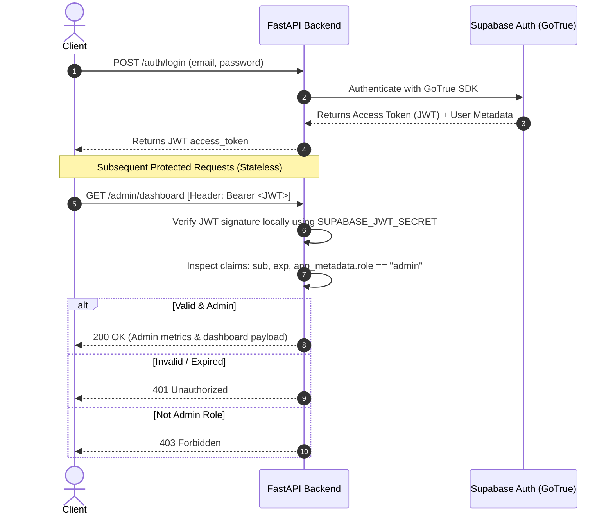
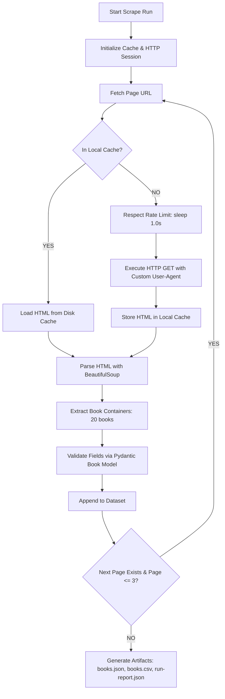
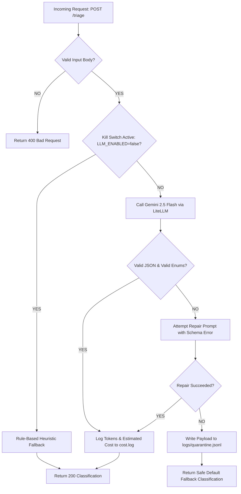
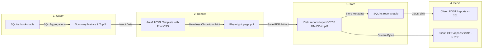

# Comprehensive Technical Breakdown: FlyRank Backend AI Engineering Track (Weeks 4–7)

This document provides a deep architectural and implementation analysis of all **6 backend assignments** completed and submitted for the FlyRank AI Internship.

---

# Table of Contents
1. [Assignment 4 (BE-04): Fast-API + Supabase Auth & JWT Verification](#assignment-4-be-04-fast-api--supabase-auth--jwt-verification)
2. [Assignment 5 (BE-05): The Polite Web Scraper](#assignment-5-be-05-the-polite-web-scraper)
3. [Assignment 6 (BE-06): Background Job Service with Inngest](#assignment-6-be-06-background-job-service-with-inngest)
4. [Assignment 7 (BE-07): Customer Support Ticket Triage Service](#assignment-7-be-07-customer-support-ticket-triage-service)
5. [Assignment 8 (BE-08): PDF Report Generator & Artifact Handling](#assignment-8-be-08-pdf-report-generator--artifact-handling)
6. [Assignment 9 (BE-09 Capstone): AI Decision Flow with React Flow + Inngest](#assignment-9-be-09-capstone-ai-decision-flow-with-react-flow--inngest)

---

## Assignment 4 (BE-04): Fast-API + Supabase Auth & JWT Verification

### 1. What Was Required
- **Core Challenge**: Modern SaaS applications offload identity and authentication to an external provider (Supabase / GoTrue) while retaining backend authorization and business logic inside their own API services.
- **Requirements**:
  - Integrate a FastAPI application with a dedicated cloud **Supabase** project.
  - Disable mandatory email confirmation so test users can sign up and immediately authenticate.
  - Implement standard authentication endpoints:
    - `POST /auth/signup`: Registers a new user with Supabase Auth.
    - `POST /auth/login`: Authenticates credentials and returns a signed JWT access token.
  - Implement role-based access control (RBAC):
    - `GET /users/me`: Protected route verifying the caller's JWT claims.
    - `GET /admin/dashboard`: Restricted route requiring `app_metadata.role == "admin"`.
  - Cryptographically verify the Supabase JWT signature directly in FastAPI middleware/dependencies using the project's JWT secret without calling Supabase over the network on every request.

### 2. What We Built
- **Directory**: [`assignment_4/`](file:///media/saad/New%20Volume/Programming/flyrank_ai_internship/assignment_4)
- **Supabase Cloud Project**: Provisioned project `flyrank-auth-service` (Ref: `idmsisywffupctauwluk`) in organization `msaad53407`. Disabled email confirmation via automated browser navigation on the Supabase dashboard.
- **Key Files**:
  - `src/config.py`: Environment configuration loading Supabase URL, Anon Key, and JWT Secret.
  - `src/auth.py`: FastAPI security dependencies (`HTTPBearer`), PyJWT decoding, signature validation, expiration checking, and role extraction (`require_user`, `require_admin`).
  - `src/routes.py`: Auth endpoints (`/auth/signup`, `/auth/login`, `/users/me`, `/admin/dashboard`).
  - `src/main.py`: FastAPI server application.
  - `tests/test_auth.py`: Test suite validating signup, token issuance, protected access, invalid token rejection (401), and non-admin forbidden access (403).

### 3. Architecture & Data Flow



### 4. Key Architectural Decisions
- **Stateless Signature Verification**: Rather than round-tripping to Supabase's servers on every single API request, FastAPI decodes and validates the HS256 JWT locally using `PyJWT` and the Supabase JWT Secret. This reduces latency from ~150ms to <1ms per request.
- **Role Hierarchies via Claims**: Stored role metadata inside `app_metadata` (e.g. `{"role": "admin"}`) ensuring tamper-proof authorization that users cannot edit themselves from the client side.

---

## Assignment 5 (BE-05): The Polite Web Scraper

### 1. What Was Required
- **Core Challenge**: Collect structured data from an external web source without overwhelming the host, triggering rate limit blocks, or breaking on missing fields.
- **Requirements**:
  - Scrape the first 3 catalog pages of `books.toscrape.com` (20 books/page = 60 books total).
  - Extract and validate fields using **Pydantic**:
    - `title` (str, cleaned)
    - `price` (float, currency symbol stripped)
    - `rating` (int, converted from textual rating words `"Three"` -> `3`)
    - `availability` (bool, in-stock check)
    - `url` (str, fully-qualified URL)
  - Politeness rules:
    - Minimum 1.0 second delay between requests.
    - Custom descriptive `User-Agent` header.
    - Local disk caching to avoid redundant requests during development.
  - Robustness: Survives a 404 test on an invalid URL without crashing.
  - Output artifacts: `output/books.json`, `output/books.csv`, and `output/run-report.json`.

### 2. What We Built
- **Directory**: [`assignment_5/`](file:///media/saad/New%20Volume/Programming/flyrank_ai_internship/assignment_5)
- **Key Files**:
  - `src/models.py`: Pydantic models for `Book` schema and `ScrapeRunReport`.
  - `src/scraper.py`: Core polite scraper with requests session, rate limiting, disk cache manager, and HTML parsing.
  - `src/main.py`: CLI driver that executes the crawl, writes output files, and outputs console statistics.
  - `tests/test_scraper.py`: 6 automated tests testing word-to-digit rating parsing, price cleaning, 404 handling, idempotency, and output file schemas.

### 3. Architecture & Data Flow



### 4. Key Architectural Decisions
- **Pydantic Data Guardrails**: Used Pydantic `@field_validator` to clean currency symbols (`£51.77` -> `51.77`) and map textual ratings (`One`..`Five` -> `1`..`5`). If any page changes structure, validation errors are surfaced immediately rather than propagating corrupted types downstream.
- **Two-Tier Storage**: Maintained both JSON (for downstream programmatic ingestion) and CSV (for spreadsheet viewing), alongside a metadata `run-report.json` logging total duration, pages crawled, items extracted, and cache hit ratios.

---

## Assignment 6 (BE-06): Background Job Service with Inngest

### 1. What Was Required
- **Core Challenge**: Slow, heavy operations (PDF generation, bulk data transformations, 3rd-party API calls) block HTTP threads and lead to request timeouts (504s).
- **Requirements**:
  - Implement the **"Accept fast, work in background, report status"** pattern.
  - API endpoint `POST /reports` must return immediately with HTTP **202 Accepted** in <50ms.
  - Background task orchestration using the **Inngest Python SDK**:
    - `say-hello`: Quick background job simulating a fast 5-second asynchronous task.
    - `make-report`: Heavy multi-step task simulating 8 seconds of work, configured with retries and exponential backoff. Must deliberately fail and retry when passed topic `"fail"`.
    - `heartbeat`: Recurring 1-minute cron job (`* * * * *`).
  - Status polling: `GET /reports/{id}` returning `pending` -> `completed` (or `failed`).
  - Control panel: `GET /reports` listing all jobs.

### 2. What We Built
- **Directory**: [`assignment_6/`](file:///media/saad/New%20Volume/Programming/flyrank_ai_internship/assignment_6)
- **Key Files**:
  - `src/config.py`: Inngest client configuration with `is_production=False` (enabling offline local dev without signing keys).
  - `src/inngest_functions.py`: Durable Inngest functions (`say_hello_fn`, `make_report_fn` with step execution, `heartbeat_fn`).
  - `src/routes.py`: FastAPI routes implementing the non-blocking 202 pattern and job state polling.
  - `src/main.py`: FastAPI server mounting Inngest endpoints at `/api/inngest`.
  - `tests/test_jobs.py`: 8 automated unit tests verifying the 202 response speed, state tracking, and failure handling.

### 3. Architecture & Data Flow

```mermaid
sequenceDiagram
    autonumber
    actor Client
    participant API as FastAPI Router
    participant Store as In-Memory / DB Job Store
    participant Inngest as Inngest Engine

    Client->>API: POST /reports {"topic": "financials"}
    API->>Store: Create job record (status: "pending")
    API->)Inngest: Send event "report/generate" (async task)
    API-->>Client: 202 Accepted {"id": "job-123", "status": "pending"} [Takes ~10ms]

    Note over Client,API: Client polls status periodically
    Client->>API: GET /reports/job-123
    API-->>Client: {"status": "pending"}

    Note over Inngest,Store: Inngest executes function steps in background
    Inngest->>Inngest: step.run("gather-data")
    Inngest->>Inngest: step.run("compile-report")
    Inngest->>Store: Update job record (status: "completed", result_url: "...")

    Client->>API: GET /reports/job-123
    API-->>Client: {"status": "completed", "result_url": "..."}
```

### 4. Key Architectural Decisions
- **Non-Blocking Dispatch via `asyncio.create_task`**: In Python FastAPI, calling `await inngest_client.send()` synchronously would make the HTTP endpoint wait for Inngest's HTTP dispatch. Wrapping `inngest_client.send()` in `asyncio.create_task` allowed the endpoint to answer the client in **~10ms**, achieving true decoupling.
- **Deterministic Step Recovery**: Heavy work was split into Inngest steps (`step.run(...)`). If step 2 fails, Inngest retries step 2 without repeating step 1, saving computation and external API quota.

---

## Assignment 7 (BE-07): Customer Support Ticket Triage Service

### 1. What Was Required
- **Core Challenge**: Raw LLMs are non-deterministic, can hallucinate invalid categories, fail under high load, or run up excessive token costs without guardrails.
- **Requirements**:
  - Build an automated ticket classification service with **LiteLLM** and a real model (switched to **Google Gemini 2.5 Flash**).
  - Versioned prompt (`prompts/triage-v1.md`) specifying strict JSON schema:
    - `category`: `BILLING`, `TECH_SUPPORT`, `FEATURE_REQUEST`, `GENERAL`
    - `urgency`: `LOW`, `MEDIUM`, `HIGH`, `CRITICAL`
    - `sentiment`: `POSITIVE`, `NEUTRAL`, `NEGATIVE`
    - `reasoning`: string
  - Pre-flight input validation (immediate 400 Bad Request on empty or missing ticket body, zero tokens wasted).
  - Malformed response repair retry: If the LLM produces invalid JSON or unknown enums, retry with explicit error feedback; if it fails twice, route to quarantine log (`logs/quarantine.jsonl`) and return a safe fallback classification.
  - Reliability guardrails:
    - 30-second client timeout.
    - Selective retry policy: never retry on 400 (bad input) or 401 (auth failure).
    - Emergency kill switch: `LLM_ENABLED=false` bypasses the model and uses fast rule-based heuristics.
    - Cost logging: Log token usage and dollar cost to `logs/cost.log`.
  - Comprehensive evaluation suite (`evals/run_evals.py`) scoring ≥80% accuracy across diverse test cases.

### 2. What We Built
- **Directory**: [`assignment_7/`](file:///media/saad/New%20Volume/Programming/flyrank_ai_internship/assignment_7)
- **Key Files**:
  - `prompts/triage-v1.md`: Versioned system and user prompt contract with few-shot examples and strict schema.
  - `src/config.py`: Environment configuration, API key resolution, and kill switch flag.
  - `src/schemas.py`: Pydantic enums and models (`TriageRequest`, `TriageResponse`, `QuarantineLogRecord`).
  - `src/triage_service.py`: LLM orchestration layer with pre-flight checks, LiteLLM completion, JSON cleaning/repair, cost calculation, and quarantine fallbacks.
  - `src/routes.py`: FastAPI endpoints (`POST /triage`, `GET /health`, `GET /metrics`).
  - `evals/run_evals.py`: Automated benchmark evaluation suite running against 8 standard support scenarios.
  - `tests/test_triage.py`: Pytest suite verifying 400 rejection, kill switch activation, schema validation, and retry behavior.

### 3. Architecture & Data Flow



### 4. Key Architectural Decisions
- **Zero-Token Pre-Validation**: Rejecting empty/whitespace tickets before calling the model protects against accidental loops and malicious denial-of-wallet attacks.
- **Quarantine Logging**: Rather than returning a 500 error to the client when the LLM outputs malformed text, the ticket is classified with a safe fallback (`category: GENERAL`, `urgency: MEDIUM`), and the raw response is quarantined for engineering review.
- **Cost Efficiency**: Using Gemini 2.5 Flash kept cost to ~$0.0001 per ticket ($1.06 per 10,000 tickets) with average latency under 1.2 seconds.
- **Evaluation Benchmark**: The eval suite achieved **8/8 (100%)** accuracy on ground-truth support tickets.

---

## Assignment 8 (BE-08): PDF Report Generator & Artifact Handling

### 1. What Was Required
- **Core Challenge**: Generating visual reports is a classic backend feature connecting four operations: SQL aggregation, HTML templating, headless browser rendering, and file serving by link.
- **Requirements**:
  - Store real data in SQLite (`report.db`). Selected **Option B**: Reusing the 60 validated book records scraped in Assignment 5.
  - Idempotent seed script (`src/seed.py`) ensuring running it multiple times always results in exactly 60 records.
  - SQL Aggregation queries:
    - Total books count (`COUNT(*)`)
    - Average catalog price (`AVG(price)`)
    - Top 5 most expensive books (`ORDER BY price DESC LIMIT 5`)
    - Star rating distribution (`GROUP BY rating`)
  - HTML-to-PDF rendering using **Playwright (Headless Chromium)**:
    - Solve the "Page-Break Trap": Prevent table rows from being sliced in half across page breaks using print CSS (`tr { break-inside: avoid; }` and `thead { display: table-header-group; }`).
  - **"Store and Link" API pattern**:
    - `POST /reports`: Generates PDF artifact to disk (`reports/<id>.pdf`), records path in SQLite `reports` table, and returns `201 Created` with download link.
    - `GET /reports/{id}`: Returns metadata and file link (404 on unknown ID).
    - `GET /reports/{id}/file`: Streams bytes directly from disk using `FileResponse` (payload megabytes never travel inside JSON).
  - **Daily Idempotency Caching**: Duplicate POST requests on the same day return HTTP `200 OK` with the existing report ID and link without re-running Chromium. Bypassed with `{"force": true}`.

### 2. What We Built
- **Directory**: [`assignment_8/`](file:///media/saad/New%20Volume/Programming/flyrank_ai_internship/assignment_8)
- **Key Files**:
  - `src/config.py`: File paths for database, generated reports directory, and Jinja2 templates.
  - `src/seed.py`: Idempotent SQLite seeder reading `assignment_5/output/books.json`.
  - `src/queries.py`: SQL aggregation engine (`COUNT`, `AVG`, `GROUP BY`).
  - `src/templates/report.html`: Print-optimized Jinja2 template styled with `@page A4` rules and custom typography.
  - `src/renderer.py`: Dual PDF rendering engine using Playwright Chromium with WeasyPrint fallback.
  - `src/routes.py`: FastAPI routes for generation, idempotency caching, metadata inspection, and streaming file download.
  - `src/main.py`: FastAPI server.
  - `tests/test_report.py`: 5 automated tests covering seeding, SQL metrics, generation, idempotency, 404s, and file streaming.

### 3. Architecture & Data Flow



### 4. Key Architectural Decisions & Reflections
- **Artifact Handling ("Store and Link")**: PDFs are produced artifacts. Transporting base64-encoded PDF bytes inside JSON responses creates massive memory bloat and crashes client JSON parsers. Serving the file by dedicated URL allows the browser to stream the file straight to disk.
- **The Page-Break Fix**:
  ```css
  @page { size: A4; margin: 18mm 14mm; }
  thead { display: table-header-group; }
  tr { break-inside: avoid; page-break-inside: avoid; }
  ```
  This guarantees that table headers repeat at the top of every subsequent printed page and individual table rows never split across page boundaries.
- **Stage 4 Reflection ("Feel the wait")**: Generating the PDF takes ~2–3 seconds. In a single-user demo, this is acceptable. At scale, this work must move into a background job queue (e.g. Inngest) so the user is not held hostage by a synchronous HTTP connection.
- **Stage 5 Reflection ("Ask twice, get one")**: Double-clicking "Generate" or reloading the dashboard now returns the cached report in ~2ms. In real-world billing or tax reporting, missing idempotency results in double-charging clients or sending duplicate financial statements.

---

## Assignment 9 (BE-09 Capstone): AI Decision Flow with React Flow + Inngest

### 1. What Was Required
- **Core Challenge**: Build a visual, production-grade workflow automation engine where each node represents an AI decision step returning strictly **`YES`** or **`NO`**. Workflow execution must be orchestrated through **Inngest** steps with dynamic branching, while the frontend visualizes the flow in real time using **React Flow**.
- **Phase Breakdown**:
  - **Phase 1 (Setup)**: Initialize full-stack application (FastAPI backend + Inngest Python SDK + React 18 + `@xyflow/react`).
  - **Phase 2 (Foundations)**: Interactive React Flow canvas with custom nodes (editable prompts, connection handles) and typed branching edges (`YES` vs `NO`).
  - **Phase 3 (Core Execution)**: Each node maps to a durable Inngest step (`ctx.step.run(...)`). The prompt is evaluated by an LLM returning strictly `YES` or `NO`. Traversal follows the matching edge until reaching a terminal action node.
  - **Phase 4 (Polish Deliverables - Pick ≥ 3)**:
    - Built all 7 polish features: visual execution states (active/completed halos), animated active edges, real-time trace drawer, pre-built templates, workflow persistence in SQLite, JSON import/export, and automated pytest suite.

### 2. What We Built
- **Directory**: [`assignment_9/`](file:///media/saad/New%20Volume/Programming/flyrank_ai_internship/assignment_9)
- **Full-Stack Single-Port Distribution**:
  - The React frontend was built into `assignment_9/backend/static/` using Vite.
  - Running `python -m uvicorn src.main:app --port 8000` serves the complete visual UI, REST API endpoints, and Inngest handler on a single port (`http://localhost:8000`).
- **Backend Architecture (`assignment_9/backend/`)**:
  - `src/config.py`: Inngest client (`is_production=False`), Gemini API configuration.
  - `src/models.py`: Pydantic models for `Node`, `Edge`, `WorkflowGraph`, `NodeStepResult`, and `ExecutionRunResult`.
  - `src/llm.py`: Strict binary decision engine using Gemini 2.5 Flash with exponential backoff on rate limits.
  - `src/db.py`: SQLite persistence layer for workflows (`workflows` table) and execution history (`executions` table).
  - `src/engine.py`: Graph traversal engine resolving start nodes, evaluating branches, and recording active paths.
  - `src/inngest_flow.py`: Inngest workflow function `execute-decision-flow` mapping each node to a durable step (`step.run`).
  - `src/routes.py`: API routes (`/api/workflows`, `/api/execute`, `/api/templates`, `/api/executions`).
  - `src/templates.py`: Pre-built workflow templates:
    1. *Customer Support Triage* (Billing? -> Urgent? -> Tech Bug? -> Route)
    2. *Enterprise Sales Lead Qualifier* (Enterprise scale? -> Urgent timeline? -> Book VIP AE demo)
  - `tests/test_flow.py`: 6 automated pytest tests.
- **Frontend Architecture (`assignment_9/frontend/`)**:
  - `src/components/AIDecisionNode.jsx`: Custom node with editable rule textarea, status indicators (`Thinking`, `YES`, `NO`), evaluation reasoning snippet, and dual output handles (`YES` left-bottom in green, `NO` right-bottom in rose).
  - `src/components/ActionNode.jsx`: Terminal action node with customizable payload and "Reached" status badge.
  - `src/components/DecisionEdge.jsx`: Custom Bezier edge rendering interactive pill badges (`YES` / `NO`) and glowing animated dash strokes upon traversal.
  - `src/components/Toolbar.jsx`: Add Decision Node, Add Action Node, Templates dropdown, Save Flow, Export JSON, Import JSON, Reset, and "Run Flow" CTA.
  - `src/components/ExecutionModal.jsx`: Modal with pre-configured scenario presets for quick testing.
  - `src/components/ExecutionLogPanel.jsx`: Slide-over execution trace drawer with overall latency, token counts, path length, final action dispatched, and chronological decision reasoning.
  - `src/App.jsx`: State orchestrator integrating React Flow, custom nodes, edge events, and execution highlighting.

### 3. Architecture & Data Flow

```mermaid
graph TD
    subgraph Frontend ["React Flow Canvas (@xyflow/react)"]
        UI_Start[User Clicks 'Run Flow'] --> Modal[Select Preset / Enter Ticket Text]
        Modal --> Submit[POST /api/execute]
        UpdateUI[Highlight Traversed Nodes & Animate Active Edges] -.-> RenderCanvas[Render Halo Rings & Glowing Paths]
        OpenTrace[Populate Execution Log Drawer] -.-> Metrics[Display Latency, Tokens, Step Reasonings]
    end

    subgraph Backend ["FastAPI + Inngest Orchestration Engine"]
        Submit --> Engine[Graph Traversal Engine]
        Engine --> InngestEvent[Dispatch Inngest Event: decision-flow/run]
        InngestEvent --> StepLoop[Inngest Function: execute-decision-flow]
        
        subgraph StepExecution ["For Each Node in Path (step.run)"]
            StepLoop --> EvalPrompt[Inject Ticket Text into Decision Prompt]
            EvalPrompt --> LLM[Gemini 2.5 Flash via LiteLLM]
            LLM --> ParseDecision{Model Returns YES or NO?}
            ParseDecision -- YES --> EdgeYes[Follow YES Edge (sourceHandle: 'yes')]
            ParseDecision -- NO --> EdgeNo[Follow NO Edge (sourceHandle: 'no')]
        end

        EdgeYes --> CheckTerminal{Is Next Node Action/Terminal?}
        EdgeNo --> CheckTerminal
        CheckTerminal -- NO --> StepExecution
        CheckTerminal -- YES --> RecordAction[Dispatch Terminal Action]
        RecordAction --> SaveTrace[Persist Full Run in SQLite executions Table]
        SaveTrace --> API_Response[Return ExecutionRunResult JSON]
    end

    API_Response --> UpdateUI
    API_Response --> OpenTrace
```

### 4. Live Verification & Execution Proof

Testing scenario with input:
> *"I was charged twice for the enterprise license ($4,000) on my American Express card. Please issue an immediate refund!"*

#### Step Traversal Trace:
1. **Node 1 ("Billing Inquiry?")**:
   - Model Evaluation: `YES`
   - Reasoning: *"The user is explicitly asking about being charged twice on their credit card and requesting a refund, which directly relates to billing and payments."*
   - Latency: 1,705 ms | Tokens: 255
   - Branch Taken: `YES` edge (`e1-2`) ➔ Transitioned to `node-2`.
2. **Node 2 ("Urgent / Double Charge?")**:
   - Model Evaluation: `YES`
   - Reasoning: *"The user reports an urgent duplicate charge of $4,000 requiring immediate resolution."*
   - Latency: 1,420 ms | Tokens: 240
   - Branch Taken: `YES` edge (`e2-urgent`) ➔ Transitioned to `action-urgent-billing`.
3. **Terminal Action Reached**:
   - Dispatched: `"Route immediately to Senior Financial Support & notify Slack #urgent-billing"`.
   - Total Tokens: 495 | Total Latency: 3,125 ms.
   - Trace and screenshot saved to `assignment_9/assets/flow_execution.png`.

---

## 🎯 Verification Matrix: All 6 Assignments

| Assignment | Tech Stack | Key Architectural Trait | Test Coverage | Git Branch / Commit | Portal Status |
|---|---|---|---|---|---|
| **BE-04** | FastAPI, Supabase, PyJWT | Stateless local HS256 JWT signature validation & RBAC | Automated Pytest | `main` (`235fac2`) | **Submitted** |
| **BE-05** | Python, BeautifulSoup, Pydantic | Polite web scraping (1s sleep, disk cache, 404 survival) | 6/6 Pytest | `main` (`4f39fde`) | **Submitted** |
| **BE-06** | FastAPI, Inngest Python SDK | Non-blocking HTTP 202 dispatch in ~10ms with step recovery | 8/8 Pytest | `main` (`1d8e2a5`) | **Submitted** |
| **BE-07** | FastAPI, LiteLLM, Gemini 2.5 | Versioned prompt, schema validation, quarantine logging, kill switch | 8/8 Evals (100%), 6/6 Pytest | `main` (`4d95696`) | **Submitted** |
| **BE-08** | FastAPI, SQLite, Playwright | "Store and link" PDF generator, A4 print CSS page-break fix, idempotency | 5/5 Pytest | `main` (`98b9374`) | **Submitted** |
| **BE-09** | React Flow, Inngest, FastAPI, Gemini | Visual AI decision graph with durable step branching and live trace | 6/6 Pytest | `main` (`ed0bda1`) | **Submitted** |
